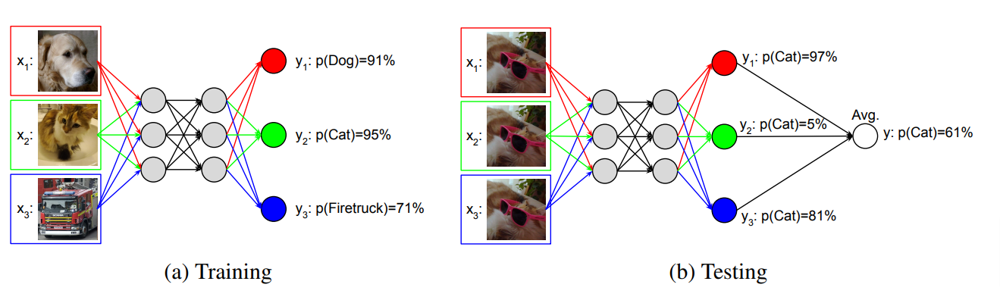

<h1 align="center">
  Implementation of MIMO models in PyTorch with Automated Hyperparameter Selection
   
</h1>
# MIMO Model in Pytorch (In Progress)
Application of Multi-Input Multi-Output (MIMO) model from the paper Training independent subnetworks for robust
prediction (Available online at https://arxiv.org/pdf/2010.06610)
in Pytorch with automated hyperparameter optimization. Project in progress.

##Summary of Multi-Input Multi-Output Models

|  | 
|:--:| 
| MIMO model structure, training and prediction phases. Image retrieved from the original paper |

MIMO models can be summarized as follows: If a
MIMO model has n number of ensemble members, n different inputs are concatenated
to create one input and fed it into the neural network and n different predictions are
extracted during the training phase of the neural network. During the evaluation phase,
the same input is multiplied n times and concatenated, and the n results of the network
are averaged to give the final result. By doing so, multiple results for an ensemble are
obtained using a single pass.

The advantages of MIMO networks are twofold. MIMO method only needs a single pass to get a prediction as opposed
to most other ensemble model architectures. The Second advantage of MIMO models is obtained 
by taking advantage of the overparametarization of neural networks. 
Conventional neural networks can be pruned 70-80% without hurting their’ performance due to overparameterization. MIMO increases the information density 
contained in a neural network by fitting multiple ensemble members into the same network without, 
in theory, the need to increase the
size of the neural network. This not only reduces the chance of overfitting but also
provides a further decrease in the run cost of a network.